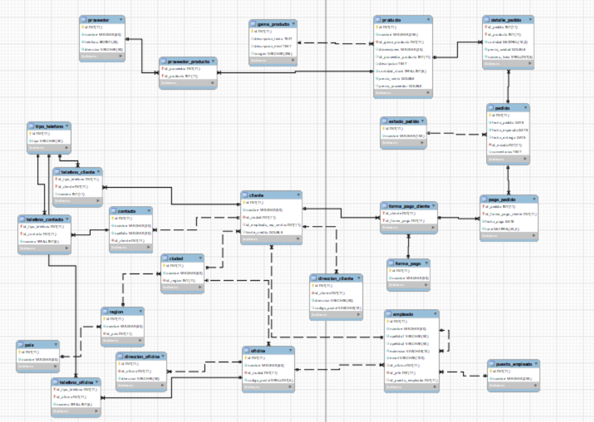

# Normalización Base de datos



## Comandos DDL

```sql

CREATE TABLE pais (
    id INT AUTO_INCREMENT PRIMARY KEY,
    nombre VARCHAR(60) NOT NULL
);

CREATE TABLE region (
    id INT AUTO_INCREMENT PRIMARY KEY,
    nombre VARCHAR(60) NOT NULL,
    id_pais INT NOT NULL,
    CONSTRAINT FK_id_pais_region FOREIGN KEY (id_pais)
        REFERENCES pais (id)
);

CREATE TABLE ciudad (
    id INT AUTO_INCREMENT PRIMARY KEY,
    nombre VARCHAR(60) NOT NULL,
    id_region INT NOT NULL,
    CONSTRAINT FK_id_region FOREIGN KEY (id_region)
        REFERENCES region (id)
);

CREATE TABLE oficina (
    id INT AUTO_INCREMENT PRIMARY KEY,
    nombre VARCHAR(60) NOT NULL,
    id_ciudad INT NOT NULL,
    codigo_postal SMALLINT NOT NULL,
    CONSTRAINT FK_ciudad FOREIGN KEY (id_ciudad)
        REFERENCES ciudad (id)
);

CREATE TABLE empleado (
    id INT AUTO_INCREMENT PRIMARY KEY,
    nombre VARCHAR(50) NOT NULL,
    apellido1 VARCHAR(50) NOT NULL,
    apellido2 VARCHAR(50),
    extension VARCHAR(10) NOT NULL,
    email VARCHAR(100) NOT NULL,
    id_oficina INT,
    id_jefe INT NOT NULL,
    id_puesto_empleado SMALLINT,
    CONSTRAINT FK_id_jefe FOREIGN KEY (id_jefe)
        REFERENCES empleado (id),
    CONSTRAINT FK_id_puesto_empleado FOREIGN KEY (id_puesto_empleado)
        REFERENCES puesto_empleado (id),
    CONSTRAINT FK_oficina FOREIGN KEY (id_oficina)
        REFERENCES oficina (id)
);

CREATE TABLE cliente (
    id INT AUTO_INCREMENT PRIMARY KEY,
    nombre VARCHAR(50) NOT NULL,
    id_ciudad INT NOT NULL,
    id_empleado_rep_ventas INT,
    limite_credito DOUBLE,
    CONSTRAINT FK_id_ciudad FOREIGN KEY (id_ciudad)
        REFERENCES ciudad (id),
    CONSTRAINT FK_id_empleado_rep_ventas FOREIGN KEY (id_empleado_rep_ventas)
        REFERENCES empleado (id)
);

CREATE TABLE contacto (
    id INT AUTO_INCREMENT PRIMARY KEY,
    nombre VARCHAR(30) NOT NULL,
    apellido VARCHAR(30) NOT NULL,
    id_cliente INT NOT NULL,
    CONSTRAINT FK_id_cliente FOREIGN KEY (id_cliente)
        REFERENCES cliente (id)
);

CREATE TABLE producto (
    id INT AUTO_INCREMENT PRIMARY KEY,
    nombre VARCHAR(255) NOT NULL,
    id_gama_producto SMALLINT NOT NULL,
    dimensiones VARCHAR(25),
    id_proveedor_producto INT,
    descripcion TEXT,
    cantidad_stock SMALLINT NOT NULL,
    precio_venta DOUBLE NOT NULL,
    precio_proveedor DOUBLE,
    CONSTRAINT FK_id_gama_producto_producto FOREIGN KEY (id_gama_producto)
        REFERENCES gama_producto (id)
);

CREATE TABLE pedido (
    id INT AUTO_INCREMENT PRIMARY KEY,
    fecha_pedido DATE NOT NULL,
    fecha_esperada DATE NOT NULL,
    fecha_entrega DATE,
    id_estado SMALLINT NOT NULL,
    comentarios TEXT,
    CONSTRAINT FK_id_estado_pedido FOREIGN KEY (id_estado)
        REFERENCES estado_pedido (id)
);

CREATE TABLE gama_producto (
    id INT AUTO_INCREMENT PRIMARY KEY,
    descripcion_texto TEXT,
    descripcion_html TEXT,
    imagen VARCHAR(256)
);

CREATE TABLE estado_pedido (
    id INT AUTO_INCREMENT PRIMARY KEY,
    nombre VARCHAR(100) NOT NULL
);

CREATE TABLE proveedor (
    id INT AUTO_INCREMENT PRIMARY KEY,
    nombre VARCHAR(60) NOT NULL,
    telefono BIGINT NOT NULL,
    direccion VARCHAR(50) NOT NULL
);

CREATE TABLE proveedor_producto (
    id_proveedor INT,
    id_producto INT,
    PRIMARY KEY (id_proveedor, id_producto),
    CONSTRAINT FK_id_proveedor_proveedor FOREIGN KEY (id_proveedor)
        REFERENCES proveedor (id),
    CONSTRAINT FK_id_producto_proveedor FOREIGN KEY (id_producto)
        REFERENCES producto (id)
);

CREATE TABLE puesto_empleado (
    id INT AUTO_INCREMENT PRIMARY KEY,
    nombre VARCHAR(255) NOT NULL
);

CREATE TABLE forma_pago (
    id INT AUTO_INCREMENT PRIMARY KEY,
    nombre VARCHAR(50) NOT NULL
);

CREATE TABLE forma_pago_cliente (
    id INT AUTO_INCREMENT PRIMARY KEY,
    id_cliente INT,
    id_forma_pago INT,
    UNIQUE KEY (id_cliente, id_forma_pago), 
    CONSTRAINT FK_id_cliente_forma_pago FOREIGN KEY (id_cliente)
        REFERENCES cliente (id),
    CONSTRAINT FK_id_forma_pago FOREIGN KEY (id_forma_pago)
        REFERENCES forma_pago (id)
);

CREATE TABLE detalle_pedido (
    id_pedido SMALLINT NOT NULL,
    id_producto SMALLINT NOT NULL,
    cantidad NUMERIC NOT NULL,
    precio_unidad DOUBLE NOT NULL,
    numero_linea SMALLINT NOT NULL,
    PRIMARY KEY (id_pedido, id_producto),
    CONSTRAINT FK_id_pedido FOREIGN KEY (id_pedido)
        REFERENCES pedido (id),
    CONSTRAINT FK_producto FOREIGN KEY (id_producto)
        REFERENCES producto (id)
);

CREATE TABLE pago_pedido (
    id_pedido SMALLINT NOT NULL,
    id_forma_pago_cliente INT NOT NULL,
    fecha_pago DATE NOT NULL,
    total NUMERIC(25, 0) NOT NULL,
    PRIMARY KEY (id_pedido, id_forma_pago_cliente),
    CONSTRAINT FK_id_pedido_pago FOREIGN KEY (id_pedido)
        REFERENCES pedido (id),
    CONSTRAINT FK_id_forma_pago_cliente_pago FOREIGN KEY (id_forma_pago_cliente)
        REFERENCES forma_pago_cliente (id)
);

CREATE TABLE direccion_cliente (
    id INT AUTO_INCREMENT PRIMARY KEY,
    id_cliente INT NOT NULL,
    direccion VARCHAR(50) NOT NULL,
    codigo_postal VARCHAR(10),
    CONSTRAINT FK_id_cliente_direccion FOREIGN KEY (id_cliente)
        REFERENCES cliente (id)
);

CREATE TABLE direccion_oficina (
    id INT AUTO_INCREMENT PRIMARY KEY,
    id_oficina INT NOT NULL,
    direccion VARCHAR(50) NOT NULL,
    CONSTRAINT FK_id_oficina_direccion FOREIGN KEY (id_oficina)
        REFERENCES oficina (id)
);

CREATE TABLE telefono_cliente (
    id_tipo_telefono SMALLINT NOT NULL,
    id_cliente INT NOT NULL,
    PRIMARY KEY (id_tipo_telefono, id_cliente),
    CONSTRAINT FK_id_tipo_telefono_cliente FOREIGN KEY (id_tipo_telefono)
        REFERENCES tipo_telefono (id),
    CONSTRAINT FK_id_cliente_telefono FOREIGN KEY (id_cliente)
        REFERENCES cliente (id)
);

CREATE TABLE telefono_contacto (
    id_tipo_telefono SMALLINT NOT NULL,
    id_contacto INT NOT NULL,
    numero SMALLINT NOT NULL,
    PRIMARY KEY (id_tipo_telefono, id_contacto),
    CONSTRAINT FK_id_tipo_telefono_contacto FOREIGN KEY (id_tipo_telefono)
        REFERENCES tipo_telefono (id),
    CONSTRAINT FK_id_contacto_telefono FOREIGN KEY (id_contacto)
        REFERENCES contacto (id)
);

CREATE TABLE telefono_oficina (
    id_tipo_telefono SMALLINT NOT NULL,
    id_oficina INT NOT NULL,
    numero SMALLINT NOT NULL,
    PRIMARY KEY (id_tipo_telefono, id_oficina),
    CONSTRAINT FK_id_tipo_telefono_oficina FOREIGN KEY (id_tipo_telefono)
        REFERENCES tipo_telefono (id),
    CONSTRAINT FK_id_oficina_telefono FOREIGN KEY (id_oficina)
        REFERENCES oficina (id)
);

CREATE TABLE tipo_telefono (
    id INT AUTO_INCREMENT PRIMARY KEY,
    tipo VARCHAR(50) NOT NULL
);

```

## Comandos DML

```sql
-- Datos para la tabla pais
INSERT INTO pais (nombre) VALUES ('España'), ('Francia'), ('Alemania');

-- Datos para la tabla region
INSERT INTO region (nombre, id_pais) VALUES 
('Cataluña', 1), ('Île-de-France', 2), ('Baviera', 3);

-- Datos para la tabla ciudad
INSERT INTO ciudad (nombre, id_region) VALUES 
('Barcelona', 1), ('París', 2), ('Múnich', 3);

-- Datos para la tabla oficina
INSERT INTO oficina (nombre, id_ciudad, codigo_postal) VALUES 
('Oficina Barcelona', 1, 08001), ('Oficina París', 2, 75001), ('Oficina Múnich', 3, 80331);

-- Datos para la tabla puesto_empleado
INSERT INTO puesto_empleado (nombre) VALUES 
('Gerente'), ('Asistente'), ('Vendedor');

-- Datos para la tabla empleado
INSERT INTO empleado (nombre, apellido1, apellido2, extension, email, id_oficina, id_jefe, id_puesto_empleado) VALUES 
('Juan', 'García', 'Pérez', '123', 'juan.garcia@example.com', 1, 1, 1),
('María', 'López', 'Martínez', '456', 'maria.lopez@example.com', 1, 1, 3),
('Pierre', 'Dubois', NULL, '789', 'pierre.dubois@example.com', 2, 1, 1),
('Sophie', 'Leclerc', NULL, '321', 'sophie.leclerc@example.com', 2, 3, 3),
('Hans', 'Müller', NULL, '654', 'hans.muller@example.com', 3, 1, 1),
('Anna', 'Schmidt', NULL, '987', 'anna.schmidt@example.com', 3, 5, 3);

INSERT INTO estado_pedido (nombre) VALUES
('En Progreso'),
('Completado'),
('Cancelado');

INSERT INTO forma_pago (nombre) VALUES
('Paypal'),
('Tarjeta de Crédito'),
('Transferencia Bancaria');

INSERT INTO forma_pago_cliente (id_cliente, id_forma_pago) VALUES
(1, 1),
(2, 2),
(3, 3);

INSERT INTO proveedor_producto (id_proveedor, id_producto) VALUES
(1, 4),
(2, 5),
(3, 6);

INSERT INTO detalle_pedido (id_pedido, id_producto, cantidad, precio_unidad, numero_linea) VALUES
(4, 4, 2, 1099.99, 1),
(5, 5, 1, 1799.99, 1),
(6, 6, 3, 1999.99, 1);

INSERT INTO pago_pedido (id_pedido, id_forma_pago_cliente, fecha_pago, total) VALUES
(4, 1, '2023-04-10', 1500.50),
(5, 2, '2023-04-12', 2300.00),
(6, 3, '2023-04-15', 1800.75);

INSERT INTO producto (nombre, id_gama_producto, dimensiones, id_proveedor_producto, descripcion, cantidad_stock, precio_venta, precio_proveedor) VALUES
('iPhone 13 Pro', 1, '15 x 7 x 0.7', 1, 'Teléfono móvil de alta gama con pantalla OLED de 6.1 pulgadas', 50, 1099.99, 899.99),
('MacBook Pro 2021', 2, '14.9 x 9.8 x 0.64', 2, 'Portátil potente con chip M1, pantalla Retina de 13.3 pulgadas', 30, 1799.99, 1399.99),
('Samsung QLED Q90R', 3, '65 pulgadas', 3, 'Televisor QLED con resolución 4K y tecnología HDR', 20, 1999.99, 1599.99);

INSERT INTO cliente (nombre, id_ciudad, id_empleado_rep_ventas, limite_credito) VALUES
('Juan Pérez', 1, 1, 2000.00),
('María García', 2, 2, 2500.00),
('Pedro Martínez', 3, 3, 1800.00);

INSERT INTO contacto (nombre, apellido, id_cliente) VALUES
('Ana', 'López', 1),
('Miguel', 'Rodríguez', 2),
('Sofía', 'Fernández', 3);

INSERT INTO gama_producto (descripcion_texto, descripcion_html, imagen) VALUES
('Electrónica de Consumo', 'Electrónica de Consumo - HTML', 'imagen_electronica.jpg'),
('Informática', 'Informática - HTML', 'imagen_informatica.jpg'),
('Electrodomésticos', 'Electrodomésticos - HTML', 'imagen_electrodomesticos.jpg');

INSERT INTO proveedor (nombre, telefono, direccion) VALUES
('Apple Inc.', 123456789, 'One Apple Park Way, Cupertino, CA, USA'),
('Samsung Electronics Co., Ltd.', 987654321, '129 Samsung-ro, Maetan-dong, Yeongtong-gu, Suwon-si, Gyeonggi-do, South Korea'),
('Sony Corporation', 456123789, '1-7-1 Konan, Minato-ku, Tokyo, Japan');

INSERT INTO pedido (fecha_pedido, fecha_esperada, fecha_entrega, id_estado, comentarios) VALUES
('2024-04-10', '2024-04-15', NULL, 1, 'Pedido urgente'),
('2024-04-11', '2024-04-16', '2024-04-16', 2, NULL),
('2024-04-12', '2024-04-17', '2024-04-18', 3, 'Entrega parcial');

INSERT INTO forma_pago_cliente (id_cliente, id_forma_pago) VALUES
(1, 1),
(2, 2),
(3, 3);

INSERT INTO direccion_cliente (id_cliente, direccion, codigo_postal) VALUES
(1, 'Calle Mayor 123', '28001'),
(2, 'Avenida Libertad 45', '28002'),
(3, 'Paseo del Prado 67', '28003');

INSERT INTO direccion_oficina (id_oficina, direccion) VALUES
(1, 'Calle Gran Vía 12'),
(2, 'Plaza de España 34'),
(3, 'Calle Alcalá 89');

INSERT INTO telefono_cliente (id_tipo_telefono, id_cliente, numero) VALUES
(1, 1, 123456789),
(2, 2, 987654321),
(3, 3, 555666777);

INSERT INTO telefono_contacto (id_tipo_telefono, id_contacto, numero) VALUES
(1, 1, 111222333),
(2, 2, 444555666),
(3, 3, 777888999);

INSERT INTO telefono_oficina (id_tipo_telefono, id_oficina, numero) VALUES
(1, 1, 999888777),
(2, 2, 666555444),
(3, 3, 333222111);
```

## Nivel normalizacion

**1. Tabla Pais:**

- **1NF:** Cada celda contiene un solo valor y no hay grupos repetitivos de datos.
- **2NF:** No hay claves parciales ni dependencias transitivas.
- **3NF:** No presenta dependencias transitivas.
- **4NF:** No hay dependencias multivaluadas ni dependencias de unión.

**2. Tabla Región:**

- **1NF:** Cada celda contiene un solo valor y no hay grupos repetitivos de datos.
- **2NF:** No hay claves parciales ni dependencias transitivas.
- **3NF:** No presenta dependencias transitivas.
- **4NF:** No hay dependencias multivaluadas ni dependencias de unión.

**3. Tabla Ciudad:**

- **1NF:** Cada celda contiene un solo valor y no hay grupos repetitivos de datos.
- **2NF:** No hay claves parciales ni dependencias transitivas.
- **3NF:** No presenta dependencias transitivas.
- **4NF:** No hay dependencias multivaluadas ni dependencias de unión.

**4. Tabla Oficina:**

- **1NF:** Cada celda contiene un solo valor y no hay grupos repetitivos de datos.
- **2NF:** No hay claves parciales ni dependencias transitivas.
- **3NF:** No presenta dependencias transitivas.
- **4NF:** No hay dependencias multivaluadas ni dependencias de unión.

**5. Tabla Empleado:**

- **1NF:** Cada celda contiene un solo valor y no hay grupos repetitivos de datos.
- **2NF:** No hay claves parciales ni dependencias transitivas.
- **3NF:** No presenta dependencias transitivas.
- **4NF:** No hay dependencias multivaluadas ni dependencias de unión.

**6. Tabla Cliente:**

- **1NF:** Cada celda contiene un solo valor y no hay grupos repetitivos de datos.
- **2NF:** No hay claves parciales ni dependencias transitivas.
- **3NF:** No presenta dependencias transitivas.
- **4NF:** No hay dependencias multivaluadas ni dependencias de unión.

**7. Tabla Contacto:**

- **1NF:** Cada celda contiene un solo valor y no hay grupos repetitivos de datos.
- **2NF:** No hay claves parciales ni dependencias transitivas.
- **3NF:** No presenta dependencias transitivas.
- **4NF:** No hay dependencias multivaluadas ni dependencias de unión.

**8. Tabla Producto:**

- **1NF:** Cada celda contiene un solo valor y no hay grupos repetitivos de datos.
- **2NF:** No hay claves parciales ni dependencias transitivas.
- **3NF:** No presenta dependencias transitivas.
- **4NF:** No hay dependencias multivaluadas ni dependencias de unión.

**9. Tabla Pedido:**

- **1NF:** Cada celda contiene un solo valor y no hay grupos repetitivos de datos.
- **2NF:** No hay claves parciales ni dependencias transitivas.
- **3NF:** No presenta dependencias transitivas.
- **4NF:** No hay dependencias multivaluadas ni dependencias de unión.

**10. Tabla Gama Producto:**

- **1NF:** Cada celda contiene un solo valor y no hay grupos repetitivos de datos.
- **2NF:** No hay claves parciales ni dependencias transitivas.
- **3NF:** No presenta dependencias transitivas.
- **4NF:** No hay dependencias multivaluadas ni dependencias de unión.

**11. Tabla Estado Pedido:**

- **1NF:** Cada celda contiene un solo valor y no hay grupos repetitivos de datos.
- **2NF:** No hay claves parciales ni dependencias transitivas.
- **3NF:** No presenta dependencias transitivas.
- **4NF:** No hay dependencias multivaluadas ni dependencias de unión.

**12. Tabla Proveedor:**

- **1NF:** Cada celda contiene un solo valor y no hay grupos repetitivos de datos.
- **2NF:** No hay claves parciales ni dependencias transitivas.
- **3NF:** No presenta dependencias transitivas.
- **4NF:** No hay dependencias multivaluadas ni dependencias de unión.

**13. Tabla Proveedor Producto:**

- **1NF:** Cada celda contiene un solo valor y no hay grupos repetitivos de datos.
- **2NF:** No hay claves parciales ni dependencias transitivas.
- **3NF:** No presenta dependencias transitivas.
- **4NF:** No hay dependencias multivaluadas ni dependencias de unión.

**14. Tabla Puesto Empleado:**

- **1NF:** Cada celda contiene un solo valor y no hay grupos repetitivos de datos.
- **2NF:** No hay claves parciales ni dependencias transitivas.
- **3NF:** No presenta dependencias transitivas.
- **4NF:** No hay dependencias multivaluadas ni dependencias de unión.

**15. Tabla Forma Pago:**

- **1NF:** Cada celda contiene un solo valor y no hay grupos repetitivos de datos.
- **2NF:** No hay claves parciales ni dependencias transitivas.
- **3NF:** No presenta dependencias transitivas.
- **4NF:** No hay dependencias multivaluadas ni dependencias de unión.

**16. Tabla Forma Pago Cliente:**

- **1NF:** Cada celda contiene un solo valor y no hay grupos repetitivos de datos.
- **2NF:** No hay claves parciales ni dependencias transitivas.
- **3NF:** No presenta dependencias transitivas.
- **4NF:** No hay dependencias multivaluadas ni dependencias de unión.

**17. Tabla Detalle Pedido:**

- **1NF:** Cada celda contiene un solo valor y no hay grupos repetitivos de datos.
- **2NF:** No hay claves parciales ni dependencias transitivas.
- **3NF:** No presenta dependencias transitivas.
- **4NF:** No hay dependencias multivaluadas ni dependencias de unión.

**18. Tabla Pago Pedido:**

- **1NF:** Cada celda contiene un solo valor y no hay grupos repetitivos de datos.
- **2NF:** No hay claves parciales ni dependencias transitivas.
- **3NF:** No presenta dependencias transitivas.
- **4NF:** No hay dependencias multivaluadas ni dependencias de unión.

**19. Tabla Dirección Cliente:**

- **1NF:** Cada celda contiene un solo valor y no hay grupos repetitivos de datos.
- **2NF:** No hay claves parciales ni dependencias transitivas.
- **3NF:** No presenta dependencias transitivas.
- **4NF:** No hay dependencias multivaluadas ni dependencias de unión.

**20. Tabla Dirección Oficina:**

- **1NF:** Cada celda contiene un solo valor y no hay grupos repetitivos de datos.
- **2NF:** No hay claves parciales ni dependencias transitivas.
- **3NF:** No presenta dependencias transitivas.
- **4NF:** No hay dependencias multivaluadas ni dependencias de unión.

**21. Tabla Teléfono Cliente:**

- **1NF:** Cada celda contiene un solo valor y no hay grupos repetitivos de datos.
- **2NF:** No hay claves parciales ni dependencias transitivas.
- **3NF:** No presenta dependencias transitivas.
- **4NF:** No hay dependencias multivaluadas ni dependencias de unión.

**22. Tabla Teléfono Contacto:**

- **1NF:** Cada celda contiene un solo valor y no hay grupos repetitivos de datos.
- **2NF:** No hay claves parciales ni dependencias transitivas.
- **3NF:** No presenta dependencias transitivas.
- **4NF:** No hay dependencias multivaluadas ni dependencias de unión.

**23. Tabla Teléfono Oficina:**

- **1NF:** Cada celda contiene un solo valor y no hay grupos repetitivos de datos.
- **2NF:** No hay claves parciales ni dependencias transitivas.
- **3NF:** No presenta dependencias transitivas.
- **4NF:** No hay dependencias multivaluadas ni dependencias de unión.

**24. Tabla Tipo Teléfono:**

- **1NF:** Cada celda contiene un solo valor y no hay grupos repetitivos de datos.

- **2NF:** No hay claves parciales ni dependencias transitivas.

- **3NF:** No presenta dependencias transitivas.

- **4NF:** No hay dependencias multivaluadas ni dependencias de unión.

  Todas las tablas parecen cumplir hasta la cuarta forma normal (4NF), ya que no presentan dependencias multivaluadas ni dependencias de unión. Cada tabla parece estar bien estructurada y sin redundancia de datos.

## Consultas sobre una tabla

1. #### Devuelve un listado con el código de oficina y la ciudad donde hay oficinas.

```sql
SELECT of.id as id_oficina, c.nombre as ciudad_oficina
FROM oficina as of
INNER JOIN ciudad as c ON of.id_ciudad = c.id;

+------------+----------------+
| id_oficina | ciudad_oficina |
+------------+----------------+
|          1 | Barcelona      |
|          2 | París          |
|          3 | Múnich         |
+------------+----------------+
```

2. #### Devuelve un listado con la ciudad y el teléfono de las oficinas de España.

```sql
SELECT of.nombre, c.nombre AS ciudad_oficina, tl_of.numero AS numero_oficina
FROM oficina as of
INNER JOIN ciudad as c ON of.id_ciudad = c.id
INNER JOIN region as r ON c.id_region = r.id
INNER JOIN pais as p ON r.id_pais = p.id
INNER JOIN telefono_oficina as tl_of ON tl_of.id_oficina = of.id
WHERE p.nombre = "España";

+-------------------+----------------+----------------+
| nombre            | ciudad_oficina | numero_oficina |
+-------------------+----------------+----------------+
| Oficina Barcelona | Barcelona      |          32767 |
+-------------------+----------------+----------------+
```

3. #### Devuelve un listado con el nombre, apellidos y email de los empleados cuyo jefe tiene un código de jefe igual a 7.

```sql
SELECT nombre, apellido1, apellido2, email
FROM empleado
WHERE id_jefe = 7;
```

4. #### Devuelve el nombre del puesto, nombre, apellidos y email del jefe de la empresa.

```sql
SELECT p.nombre, em.nombre, em.apellido1, em.apellido2, em.email
FROM empleado as em
INNER JOIN puesto_empleado as p ON p.id = em.id_puesto_empleado
WHERE em.id_puesto_empleado = 1;

+---------+--------+-----------+-----------+---------------------------+
| nombre  | nombre | apellido1 | apellido2 | email                     |
+---------+--------+-----------+-----------+---------------------------+
| Gerente | Juan   | García    | Pérez     | juan.garcia@example.com   |
| Gerente | Pierre | Dubois    | NULL      | pierre.dubois@example.com |
| Gerente | Hans   | Müller    | NULL      | hans.muller@example.com   |
+---------+--------+-----------+-----------+---------------------------+
```

5. #### Devuelve un listado con el nombre, apellidos y puesto de aquellos empleados que no sean representantes de ventas.

```sql
SELECT em.nombre, em.apellido1, em.apellido2, p.nombre
FROM empleado as em
INNER JOIN puesto_empleado AS p ON p.id = em.id_puesto_empleado
WHERE em.id_puesto_empleado != 3;

+--------+-----------+-----------+---------+
| nombre | apellido1 | apellido2 | nombre  |
+--------+-----------+-----------+---------+
| Juan   | García    | Pérez     | Gerente |
| Pierre | Dubois    | NULL      | Gerente |
| Hans   | Müller    | NULL      | Gerente |
+--------+-----------+-----------+---------+
```

6. #### Devuelve un listado con el nombre de los todos los clientes españoles.

```sql
SELECT cl.nombre
FROM cliente as cl
INNER JOIN ciudad as c ON c.id = cl.id_ciudad
INNER JOIN region AS r ON r.id = c.id_region
INNER JOIN pais AS p ON p.id = r.id_pais
WHERE p.nombre = "España";

+------------+
| nombre     |
+------------+
| Juan Pérez |
+------------+
```

7. #### Devuelve un listado con los distintos estados por los que puede pasar un pedido.

```sql
SELECT id, nombre
FROM estado_pedido;

+----+------------+
| id | nombre     |
+----+------------+
|  1 | En proceso |
|  2 | Completado |
|  3 | Cancelado  |
+----+------------+
```

8. #### Devuelve un listado con el código de cliente de aquellos clientes que realizaron algún pago en 2008. Tenga en cuenta que deberá eliminar
aquellos códigos de cliente que aparezcan repetidos.

```sql
SELECT DISTINCT fpc.id_cliente AS id_cliente
FROM pago_pedido AS pp
INNER JOIN forma_pago_cliente AS fpc ON pp.id_forma_pago_cliente = fpc.id
WHERE YEAR(pp.fecha_pago) = 2008;
```

9. #### Devuelve un listado con el código de pedido, código de cliente, fecha esperada y fecha de entrega de los pedidos que no han sido entregados a
tiempo.

```sql
SELECT p.id AS codigo_pedido, fpc.id_cliente AS codigo_cliente, p.fecha_esperada, p.fecha_entrega
FROM pedido as p
INNER JOIN pago_pedido AS pp ON p.id = pp.id_pedido
INNER JOIN forma_pago_cliente AS fpc ON pp.id_forma_pago_cliente = fpc.id
WHERE p.fecha_esperada > p.fecha_entrega;
```

10. #### Devuelve un listado con el código de pedido, código de cliente, fecha esperada y fecha de entrega de los pedidos cuya fecha de entrega ha sido al
menos dos días antes de la fecha esperada.

```sql
SELECT p.id AS codigo_pedido, fpc.id_cliente AS codigo_cliente, p.fecha_esperada, p.fecha_entrega
FROM pedido as p
INNER JOIN pago_pedido as pp ON p.id = pp.id_pedido
INNER JOIN forma_pago_cliente as fpc ON pp.id_forma_pago_cliente = fpc.id
WHERE p.fecha_entrega < ADDDATE(p.fecha_esperada, -2);
```

11. #### Devuelve un listado de todos los pedidos que fueron rechazados en 2009.

```sql
SELECT id
FROM pedido
WHERE id_estado = 3 AND YEAR(fecha_pedido) = 2009;
```

12. #### Devuelve un listado de todos los pedidos que han sido entregados en el mes de enero de cualquier año.

```sql
SELECT id
FROM pedido
WHERE MONTH(fecha_entrega) = 01;
```

13. #### Devuelve un listado con todos los pagos que se realizaron en el año 2008 mediante Paypal. Ordene el resultado de mayor a menor.

```sql
SELECT pp.fecha_pago, pp.total
FROM pago_pedido as pp
INNER JOIN forma_pago_cliente as fpc ON pp.id_forma_pago_cliente = fpc.id
INNER JOIN forma_pago as fp ON fpc.id_forma_pago = fp.id
WHERE fp.nombre = "Paypal" AND YEAR(pp.fecha_pago) = 2008
ORDER BY pp.total DESC;
```

14. #### Devuelve un listado con todas las formas de pago que aparecen en la tabla pago. Tenga en cuenta que no deben aparecer formas de pago
repetidas.

```sql
SELECT DISTINCT nombre
FROM forma_pago;

+------------------------+
| nombre                 |
+------------------------+
| Paypal                 |
| Tarjeta de Crédito     |
| Transferencia Bancaria |
+------------------------+
```

15. #### Devuelve un listado con todos los productos que pertenecen a la gama Ornamentales y que tienen más de 100 unidades en stock. El listado
deberá estar ordenado por su precio de venta, mostrando en primer lugar
los de mayor precio.

```sql
SELECT p.nombre, gp.descripcion_texto, p.precio_venta
FROM producto as p
INNER JOIN gama_producto as gp ON p.id_gama_producto = gp.id
WHERE gp.descripcion_texto = 'Ornamentales' AND p.cantidad_stock >100
ORDER BY p.precio_venta DESC;
```

16. #### Devuelve un listado con todos los clientes que sean de la ciudad de Madrid y cuyo representante de ventas tenga el código de empleado 11 o 30.

```sql
SELECT cl.id, cl.nombre
FROM cliente as cl
INNER JOIN ciudad as c ON cl.id_ciudad = c.id
WHERE c.nombre = 'Madrid' AND cl.id_empleado_rep_ventas in (11,30);
```

### Consultas multitabla (Composición interna)

1. #### Obtén un listado con el nombre de cada cliente y el nombre y apellido de su representante de ventas.

```sql
SELECT cl.nombre AS nombre_cliente, em.nombre as nombre_empleado, em.apellido1 as apellido1_empleado, em.apellido2 as apellido2_empleado
FROM cliente as cl
INNER JOIN empleado as em ON cl.id_empleado_rep_ventas = em.id;

+----------------+-----------------+--------------------+--------------------+
| nombre_cliente | nombre_empleado | apellido1_empleado | apellido2_empleado |
+----------------+-----------------+--------------------+--------------------+
| Juan Pérez     | Juan            | García             | Pérez              |
| María García   | María           | López              | Martínez           |
| Pedro Martínez | Pierre          | Dubois             | NULL               |
+----------------+-----------------+--------------------+--------------------+
```

2. #### Muestra el nombre de los clientes que hayan realizado pagos junto con el nombre de sus representantes de ventas.

```sql
SELECT cl.nombre AS nombre_cliente, em.nombre as nombre_empleado, em.apellido1 as apellido1_empleado, em.apellido2 as apellido2_empleado
FROM cliente AS cl
INNER JOIN empleado as em ON cl.id_empleado_rep_ventas = em.id
INNER JOIN forma_pago_cliente As fpc On fpc.id_cliente = cl.id
INNER JOIN pago_pedido AS pp ON pp.id_forma_pago_cliente = fpc.id;

+----------------+-----------------+--------------------+--------------------+
| nombre_cliente | nombre_empleado | apellido1_empleado | apellido2_empleado |
+----------------+-----------------+--------------------+--------------------+
| Juan Pérez     | Juan            | García             | Pérez              |
| María García   | María           | López              | Martínez           |
| Pedro Martínez | Pierre          | Dubois             | NULL               |
+----------------+-----------------+--------------------+--------------------+
```

3. #### Muestra el nombre de los clientes que no hayan realizado pagos junto con el nombre de sus representantes de ventas.

```sql
SELECT cl.nombre AS nombre_cliente, em.nombre AS nombre_empleado, em.apellido1 AS apellido1_empleado, em.apellido2 AS apellido2_empleado
FROM cliente AS cl
INNER JOIN empleado AS em ON cl.id_empleado_rep_ventas = em.id
INNER JOIN forma_pago_cliente AS fpc ON fpc.id_cliente = cl.id
LEFT JOIN pago_pedido AS pp ON fpc.id_forma_pago = pp.id_forma_pago_cliente
WHERE pp.id_forma_pago_cliente IS NULL;
```

4. #### Devuelve el nombre de los clientes que han hecho pagos y el nombre de sus representantes junto con la ciudad de la oficina a la que pertenece el
representante.

```sql
SELECT cl.nombre AS nombre_cliente, em.nombre as nombre_empleado, em.apellido1 as apellido1_empleado, em.apellido2 as apellido2_empleado, c.nombre as ciudad_oficina_representante
FROM cliente AS cl
INNER JOIN empleado as em ON cl.id_empleado_rep_ventas = em.id
INNER JOIN forma_pago_cliente As fpc On fpc.id_cliente = cl.id
INNER JOIN pago_pedido AS pp ON pp.id_forma_pago_cliente = fpc.id
INNER JOIN oficina AS of ON em.id_oficina = of.id
INNER JOIN ciudad AS c ON of.id_ciudad = c.id;

+----------------+-----------------+--------------------+--------------------+------------------------------+
| nombre_cliente | nombre_empleado | apellido1_empleado | apellido2_empleado | ciudad_oficina_representante |
+----------------+-----------------+--------------------+--------------------+------------------------------+
| Juan Pérez     | Juan            | García             | Pérez              | Barcelona                    |
| María García   | María           | López              | Martínez           | Barcelona                    |
| Pedro Martínez | Pierre          | Dubois             | NULL               | París                        |
+----------------+-----------------+--------------------+--------------------+------------------------------+
```

5. #### Devuelve el nombre de los clientes que no hayan hecho pagos y el nombre de sus representantes junto con la ciudad de la oficina a la que pertenece el
representante.

```sql
SELECT cl.nombre AS nombre_cliente, em.nombre AS nombre_empleado, em.apellido1 AS apellido1_empleado, em.apellido2 AS apellido2_empleado
FROM cliente AS cl
INNER JOIN empleado AS em ON cl.id_empleado_rep_ventas = em.id
INNER JOIN forma_pago_cliente AS fpc ON fpc.id_cliente = cl.id
INNER JOIN pago_pedido AS pp ON pp.id_forma_pago_cliente = fpc.id
INNER JOIN oficina AS of ON em.id_oficina = of.id
INNER JOIN ciudad AS c ON of.id_ciudad = c.id;
WHERE pp.id_forma_pago_cliente IS NULL;

```

6. #### Lista la dirección de las oficinas que tengan clientes en Fuenlabrada.

```sql
SELECT df.direccion AS direccion_oficina
FROM oficina AS of
INNER JOIN empleado as em ON em.id_oficina = of.id
INNER JOIN cliente as cl ON cl.id_empleado_rep_ventas = em.id
INNER JOIN ciudad as c ON cl.id_ciudad = c.id
INNER JOIn direccion_oficina as df ON df.id_oficina = of.id
WHERE c.nombre = 'Fuenlabrada';
```

7. #### Devuelve el nombre de los clientes y el nombre de sus representantes junto con la ciudad de la oficina a la que pertenece el representante.

```sql
SELECT cl.nombre AS nombre_cliente, em.nombre as nombre_empleado, em.apellido1 as apellido1_empleado, em.apellido2 as apellido2_empleado, c.nombre as ciudad_oficina_representante
FROM cliente AS cl
INNER JOIN empleado as em ON cl.id_empleado_rep_ventas = em.id
INNER JOIN oficina AS of ON em.id_oficina = of.id
INNER JOIN ciudad AS c ON of.id_ciudad = c.id;

+----------------+-----------------+--------------------+--------------------+------------------------------+
| nombre_cliente | nombre_empleado | apellido1_empleado | apellido2_empleado | ciudad_oficina_representante |
+----------------+-----------------+--------------------+--------------------+------------------------------+
| Juan Pérez     | Juan            | García             | Pérez              | Barcelona                    |
| María García   | María           | López              | Martínez           | Barcelona                    |
| Pedro Martínez | Pierre          | Dubois             | NULL               | París                        |
+----------------+-----------------+--------------------+--------------------+------------------------------+
```

8. #### Devuelve un listado con el nombre de los empleados junto con el nombre de sus jefes.

```sql
SELECT em.nombre as nombre_empleado, em.apellido1 as apellido1_empleado, em.apellido2 as apellido2_empleado, j.nombre as nombre_jefe, j.apellido1 as apellido1_jefe, j.apellido2 as apellido2_jefe
FROM empleado as em
INNER JOIN empleado as j ON em.id_jefe = j.id;

+-----------------+--------------------+--------------------+-------------+----------------+----------------+
| nombre_empleado | apellido1_empleado | apellido2_empleado | nombre_jefe | apellido1_jefe | apellido2_jefe |
+-----------------+--------------------+--------------------+-------------+----------------+----------------+
| Juan            | García             | Pérez              | Juan        | García         | Pérez          |
| María           | López              | Martínez           | Juan        | García         | Pérez          |
| Pierre          | Dubois             | NULL               | Juan        | García         | Pérez          |
| Sophie          | Leclerc            | NULL               | Pierre      | Dubois         | NULL           |
| Hans            | Müller             | NULL               | Juan        | García         | Pérez          |
| Anna            | Schmidt            | NULL               | Hans        | Müller         | NULL           |
+-----------------+--------------------+--------------------+-------------+----------------+----------------+
```

9. #### Devuelve un listado que muestre el nombre de cada empleados, el nombre de su jefe y el nombre del jefe de sus jefe.

```sql
SELECT em.nombre as nombre_empleado, em.apellido1 as apellido1_empleado, em.apellido2 as apellido2_empleado, j.nombre as nombre_jefe, j2.nombre as jefe_del_jefe
FROM empleado as em
INNER JOIN empleado as j ON em.id_jefe = j.id
INNER JOIN empleado as j2 ON j.id_jefe = j2.id;

+-----------------+--------------------+--------------------+-------------+---------------+
| nombre_empleado | apellido1_empleado | apellido2_empleado | nombre_jefe | jefe_del_jefe |
+-----------------+--------------------+--------------------+-------------+---------------+
| Juan            | García             | Pérez              | Juan        | Juan          |
| María           | López              | Martínez           | Juan        | Juan          |
| Pierre          | Dubois             | NULL               | Juan        | Juan          |
| Sophie          | Leclerc            | NULL               | Pierre      | Juan          |
| Hans            | Müller             | NULL               | Juan        | Juan          |
| Anna            | Schmidt            | NULL               | Hans        | Juan          |
+-----------------+--------------------+--------------------+-------------+---------------+
```

10. #### Devuelve el nombre de los clientes a los que no se les ha entregado a tiempo un pedido.

```sql
SELECT cl.nombre, p.fecha_esperada, p.fecha_entrega
FROM cliente AS cl
INNER JOIN forma_pago_cliente AS fpc ON fpc.id_cliente = cl.id
INNER JOIN pago_pedido AS pp ON pp.id_forma_pago_cliente = fpc.id
INNER JOIN pedido AS p ON pp.id_pedido = p.id
WHERE p.fecha_esperada-p.fecha_entrega;

+----------------+----------------+---------------+
| nombre         | fecha_esperada | fecha_entrega |
+----------------+----------------+---------------+
| Pedro Martínez | 2024-04-17     | 2024-04-18    |
+----------------+----------------+---------------+
```

11. #### Devuelve un listado de las diferentes gamas de producto que ha comprado cada cliente.

```sql
SELECT DISTINCT cl.nombre AS nombre_cliente, gp.descripcion_texto AS gama_producto
FROM cliente cl
INNER JOIN forma_pago_cliente fpc ON fpc.id_cliente = cl.id
INNER JOIN pago_pedido pp ON pp.id_forma_pago_cliente = fpc.id
INNER JOIN pedido pd ON pp.id_pedido = pd.id
INNER JOIN detalle_pedido dp ON pd.id = dp.id_pedido
INNER JOIN producto pr ON dp.id_producto = pr.id
INNER JOIN gama_producto gp ON pr.id_gama_producto = gp.id;

+----------------+------------------------+
| nombre_cliente | gama_producto          |
+----------------+------------------------+
| Juan Pérez     | Electrónica de Consumo |
| María García   | Informática            |
| Pedro Martínez | Electrodomésticos      |
+----------------+------------------------+
```

### Consultas multitabla (Composición externa)

1. #### Devuelve un listado que muestre solamente los clientes que no han realizado ningún pago.

```sql
SELECT cl.nombre AS nombre_cliente, em.nombre AS nombre_empleado, em.apellido1 AS apellido1_empleado, em.apellido2 AS apellido2_empleado
FROM cliente AS cl
LEFT JOIN empleado AS em ON cl.id_empleado_rep_ventas = em.id
LEFT JOIN forma_pago_cliente AS fpc ON fpc.id_cliente = cl.id
LEFT JOIN pago_pedido AS pp ON pp.id_forma_pago_cliente = fpc.id
WHERE pp.id_forma_pago_cliente IS NULL;
```

2. #### Devuelve un listado que muestre solamente los clientes que no han realizado ningún pedido.

```sql
SELECT cl.nombre AS nombre_cliente, em.nombre AS nombre_empleado, em.apellido1 AS apellido1_empleado, em.apellido2 AS apellido2_empleado
FROM cliente AS cl
LEFT JOIN empleado AS em ON cl.id_empleado_rep_ventas = em.id
LEFT JOIN forma_pago_cliente AS fpc ON fpc.id_cliente = cl.id
LEFT JOIN pago_pedido AS pp ON pp.id_forma_pago_cliente = fpc.id
WHERE pp.id_pedido IS NULL;
```

3. #### Devuelve un listado que muestre los clientes que no han realizado ningún pago y los que no han realizado ningún pedido.

```sql
SELECT cl.nombre AS nombre_cliente, em.nombre AS nombre_empleado, em.apellido1 AS apellido1_empleado, em.apellido2 AS apellido2_empleado
FROM cliente AS cl
LEFT JOIN empleado AS em ON cl.id_empleado_rep_ventas = em.id
LEFT JOIN forma_pago_cliente AS fpc ON fpc.id_cliente = cl.id
LEFT JOIN pago_pedido AS pp ON pp.id_forma_pago_cliente = fpc.id
WHERE pp.id_pedido IS NULL AND pp.id_forma_pago_cliente IS NULL;
```

4. #### Devuelve un listado que muestre solamente los empleados que no tienen una oficina asociada.

```sql
SELECT em.nombre, em.apellido1, em.apellido2
FROM empleado as em
LEFT JOIN oficina as f ON em.id_oficina = f.id
WHERE f.id IS NULL;
```

5. #### Devuelve un listado que muestre solamente los empleados que no tienen un cliente asociado.

```sql
SELECT em.id, em.nombre, em.apellido1, em.apellido2
FROM empleado AS em
LEFT JOIN cliente AS cl ON em.id = cl.id_empleado_rep_ventas
WHERE cl.id_empleado_rep_ventas IS NULL;

+----+--------+-----------+-----------+
| id | nombre | apellido1 | apellido2 |
+----+--------+-----------+-----------+
|  4 | Sophie | Leclerc   | NULL      |
|  5 | Hans   | Müller    | NULL      |
|  6 | Anna   | Schmidt   | NULL      |
+----+--------+-----------+-----------+
```

6. #### Devuelve un listado que muestre solamente los empleados que no tienen un cliente asociado junto con los datos de la oficina donde trabajan.

```sql
SELECT em.id, em.nombre, em.apellido1, em.apellido2, of.nombre
FROM empleado AS em
LEFT JOIN cliente AS cl ON em.id = cl.id_empleado_rep_ventas
LEFT JOIN oficina AS of ON of.id = em.id_oficina
WHERE cl.id_empleado_rep_ventas IS NULL;

+----+--------+-----------+-----------+----------------+
| id | nombre | apellido1 | apellido2 | nombre         |
+----+--------+-----------+-----------+----------------+
|  4 | Sophie | Leclerc   | NULL      | Oficina París  |
|  5 | Hans   | Müller    | NULL      | Oficina Múnich |
|  6 | Anna   | Schmidt   | NULL      | Oficina Múnich |
+----+--------+-----------+-----------+----------------+
```

7. #### Devuelve un listado que muestre los empleados que no tienen una oficina asociada y los que no tienen un cliente asociado.

```sql
SELECT em.id, em.nombre, em.apellido1, em.apellido2, of.nombre
FROM empleado AS em
LEFT JOIN cliente AS cl ON em.id = cl.id_empleado_rep_ventas
LEFT JOIN oficina AS of ON of.id = em.id_oficina
WHERE cl.id_empleado_rep_ventas IS NULL AND em.id_oficina IS NULL;
```

8. #### Devuelve un listado de los productos que nunca han aparecido en un pedido.

```sql
SELECT p.nombre
FROM producto AS p
LEFT JOIN detalle_pedido as dp ON p.id = dp.id_producto
WHERE dp.id_producto IS NULL;
```

9. #### Devuelve un listado de los productos que nunca han aparecido en un pedido. El resultado debe mostrar el nombre, la descripción y la imagen del
producto.

```sql
SELECT p.nombre, gp.descripcion_texto, gp.imagen
FROM producto AS p
LEFT JOIN detalle_pedido AS dp ON p.id = dp.id_producto
LEFT JOIN gama_producto AS gp ON gp.id = p.id_gama_producto
WHERE dp.id_producto IS NULL;

```

10. #### Devuelve las oficinas donde no trabajan ninguno de los empleados que hayan sido los representantes de ventas de algún cliente que haya realizado
la compra de algún producto de la gama Frutales.

```sql
SELECT DISTINCT ofi.id, ofi.nombre
FROM oficina AS ofi
LEFT JOIN empleado AS em ON ofi.id = em.id_oficina
WHERE em.id IN (
    SELECT DISTINCT cl.id_empleado_rep_ventas
    FROM cliente AS cl
    INNER JOIN forma_pago_cliente AS fpc ON cl.id = fpc.id_cliente
    INNER JOIN pago_pedido AS pp ON fpc.id = pp.id_forma_pago_cliente
    INNER JOIN pedido AS p ON pp.id_pedido = p.id
    INNER JOIN detalle_pedido AS dp ON p.id = dp.id_pedido
    INNER JOIN producto AS pro ON dp.id_producto = pro.id
    INNER JOIN gama_producto AS gp ON pro.id_gama_producto = gp.id
    WHERE gp.descripcion_texto = 'Frutales'
);

```

11. #### Devuelve un listado con los clientes que han realizado algún pedido pero no han realizado ningún pago.

```sql
SELECT DISTINCT cl.id, cl.nombre
FROM cliente AS cl
INNER JOIN pedido AS p ON cl.id = p.id_cliente
LEFT JOIN pago_pedido AS pp ON p.id = pp.id_pedido
WHERE pp.id_pedido IS NULL;
```

12. #### Devuelve un listado con los datos de los empleados que no tienen clientes asociados y el nombre de su jefe asociado.

```sql
SELECT em.id, em.nombre, em.apellido1, em.apellido2, em.id_jefe, j.nombre AS nombre_jefe, j.apellido1 AS apellido1_jefe, j.apellido2 AS apellido2_jefe
FROM empleado AS em
LEFT JOIN cliente AS c ON em.id = c.id_empleado_rep_ventas
INNER JOIN empleado AS j ON em.id_jefe = j.id
WHERE c.id_empleado_rep_ventas IS NULL;

+----+--------+-----------+-----------+---------+-------------+----------------+----------------+
| id | nombre | apellido1 | apellido2 | id_jefe | nombre_jefe | apellido1_jefe | apellido2_jefe |
+----+--------+-----------+-----------+---------+-------------+----------------+----------------+
|  4 | Sophie | Leclerc   | NULL      |       3 | Pierre      | Dubois         | NULL           |
|  5 | Hans   | Müller    | NULL      |       1 | Juan        | García         | Pérez          |
|  6 | Anna   | Schmidt   | NULL      |       5 | Hans        | Müller         | NULL           |
+----+--------+-----------+-----------+---------+-------------+----------------+----------------+
```

### Consultas resumen

1. #### ¿Cuántos empleados hay en la compañía?

```sql
SELECT COUNT(nombre) as empleados_compañia
FROM empleado;

+--------------------+
| empleados_compañia |
+--------------------+
|                  6 |
+--------------------+
```

2. #### ¿Cuántos clientes tiene cada país?

```sql
SELECT p.nombre AS pais, COUNT(cl.id) AS total_clientes
FROM cliente AS cl
INNER JOIN ciudad AS c ON cl.id_ciudad = c.id
INNER JOIN region AS r ON c.id_region = r.id
INNER JOIN pais AS p ON r.id_pais = p.id
GROUP BY p.nombre;

+----------+----------------+
| pais     | total_clientes |
+----------+----------------+
| Alemania |              1 |
| España   |              1 |
| Francia  |              1 |
+----------+----------------+

```

3. #### ¿Cuál fue el pago medio en 2009?

```sql
SELECT AVG(total) AS pago_medio_2009
FROM pago_pedido
WHERE YEAR(fecha_pago) = 2009;

+-----------------+
| pago_medio_2009 |
+-----------------+
|            NULL |
+-----------------+
```

4. #### ¿Cuántos pedidos hay en cada estado? Ordena el resultado de forma descendente por el número de pedidos.

```sql
SELECT ep.nombre AS estado, COUNT(p.id) AS total_pedidos
FROM pedido as p
INNER JOIN estado_pedido AS ep ON ep.id = p.id_estado
GROUP BY ep.nombre;

+------------+---------------+
| estado     | total_pedidos |
+------------+---------------+
| Cancelado  |             1 |
| Completado |             1 |
| En proceso |             1 |
+------------+---------------+
```

5. #### Calcula el precio de venta del producto más caro y más barato en una misma consulta.

```sql
SELECT (SELECT MAX(precio_venta) FROM producto) AS precio_mas_caro, (SELECT MIN(precio_venta) FROM producto) AS precio_mas_barato;
    
+-----------------+-------------------+
| precio_mas_caro | precio_mas_barato |
+-----------------+-------------------+
|         1999.99 |           1099.99 |
+-----------------+-------------------+

```

6. #### Calcula el número de clientes que tiene la empresa.

```sql
SELECT COUNT(nombre) AS numero_clientes
FROM cliente;

+-----------------+
| numero_clientes |
+-----------------+
|               3 |
+-----------------+
```

7. #### ¿Cuántos clientes existen con domicilio en la ciudad de Madrid?

```sql
SELECT c.nombre AS ciudad, COUNT(cl.id) AS numero_clientes
FROM cliente AS cl
INNER JOIN ciudad AS c On cl.id_ciudad = c.id
GROUP BY c.nombre;

+-----------+-----------------+
| ciudad    | numero_clientes |
+-----------+-----------------+
| Barcelona |               1 |
| Múnich    |               1 |
| París     |               1 |
+-----------+-----------------+
```

8. #### ¿Calcula cuántos clientes tiene cada una de las ciudades que empiezan por M?

```sql
SELECT c.nombre AS ciudad, COUNT(cl.id) AS numero_clientes
FROM cliente AS cl
INNER JOIN ciudad AS c ON cl.id_ciudad = c.id
WHERE c.nombre LIKE 'M%'
GROUP BY c.nombre;

+--------+-----------------+
| ciudad | numero_clientes |
+--------+-----------------+
| Múnich |               1 |
+--------+-----------------+
```

9. #### Devuelve el nombre de los representantes de ventas y el número de clientes al que atiende cada uno.

```sql
SELECT em.nombre as representante, COUNT(cl.id) as numero_clientes
FROM empleado AS em
INNER JOIN cliente as cl ON cl.id_empleado_rep_ventas = em.id
GROUP BY em.nombre;

+---------------+-----------------+
| representante | numero_clientes |
+---------------+-----------------+
| Juan          |               1 |
| María         |               1 |
| Pierre        |               1 |
+---------------+-----------------+
```

10. #### Calcula el número de clientes que no tiene asignado representante de ventas.

```sql
SELECT COUNT(cl.id) AS numero_clientes_sin_representante
FROM cliente AS cl
INNER JOIN empleado AS em ON em.id = cl.id_empleado_rep_ventas
WHERE em.id IS NULL;

+-----------------------------------+
| numero_clientes_sin_representante |
+-----------------------------------+
|                                 0 |
+-----------------------------------+
```

11. #### Calcula la fecha del primer y último pago realizado por cada uno de los clientes. El listado deberá mostrar el nombre y los apellidos de cada cliente.

```sql
SELECT cl.nombre AS nombre_cliente, MIN(pp.fecha_pago) AS primer_pago, MAX(pp.fecha_pago) AS ultimo_pago
FROM cliente AS cl
INNER JOIN forma_pago_cliente AS fpc ON cl.id = fpc.id_cliente
INNER JOIN pago_pedido AS pp ON fpc.id = pp.id_forma_pago_cliente
GROUP BY cl.id;

+----------------+-------------+-------------+
| nombre_cliente | primer_pago | ultimo_pago |
+----------------+-------------+-------------+
| Juan Pérez     | 2024-04-10  | 2024-04-10  |
| María García   | 2024-04-11  | 2024-04-11  |
| Pedro Martínez | 2024-04-12  | 2024-04-12  |
+----------------+-------------+-------------+
```

12. #### Calcula el número de productos diferentes que hay en cada uno de los pedidos.

```sql
SELECT id_pedido,  COUNT(DISTINCT id_producto) AS num_productos_diferentes
FROM detalle_pedido
GROUP BY id_pedido;

+-----------+--------------------------+
| id_pedido | num_productos_diferentes |
+-----------+--------------------------+
|         4 |                        1 |
|         5 |                        1 |
|         6 |                        1 |
+-----------+--------------------------+
```

13. #### Calcula la suma de la cantidad total de todos los productos que aparecen en cada uno de los pedidos.

```sql
SELECT id_pedido, SUM(cantidad) AS cantidad_total
FROM detalle_pedido
GROUP BY id_pedido;

+-----------+----------------+
| id_pedido | cantidad_total |
+-----------+----------------+
|         4 |              2 |
|         5 |              1 |
|         6 |              3 |
+-----------+----------------+
```

14. #### Devuelve un listado de los 20 productos más vendidos y el número total de unidades que se han vendido de cada uno. El listado deberá estar ordenado
por el número total de unidades vendidas.

```sql
SELECT p.nombre AS nombre_producto, SUM(dp.cantidad) AS total_unidades_vendidas
FROM detalle_pedido AS dp
INNER JOIN producto AS p ON dp.id_producto = p.id
GROUP BY p.nombre
ORDER BY total_unidades_vendidas DESC
LIMIT 20;

+-------------------+-------------------------+
| nombre_producto   | total_unidades_vendidas |
+-------------------+-------------------------+
| Samsung QLED Q90R |                       3 |
| iPhone 13 Pro     |                       2 |
| MacBook Pro 2021  |                       1 |
+-------------------+-------------------------+
```

15. #### La facturación que ha tenido la empresa en toda la historia, indicando la base imponible, el IVA y el total facturado. La base imponible se calcula
sumando el coste del producto por el número de unidades vendidas de la
tabla detalle_pedido. El IVA es el 21 % de la base imponible, y el total la
suma de los dos campos anteriores.

```sql
SELECT SUM(dp.cantidad * p.precio_venta) AS base_imponible, SUM(dp.cantidad * p.precio_venta) * 0.21 AS iva, SUM(dp.cantidad * p.precio_venta) + (SUM(dp.cantidad * p.precio_venta) * 0.21) AS total_facturado
FROM detalle_pedido AS dp
INNER JOIN producto AS p ON dp.id_producto = p.id;

+----------------+-----------+-----------------+
| base_imponible | iva       | total_facturado |
+----------------+-----------+-----------------+
|        9999.94 | 2099.9874 |      12099.9274 |
+----------------+-----------+-----------------+
```

16. #### La misma información que en la pregunta anterior, pero agrupada por código de producto.

```sql
SELECT dp.id_producto, SUM(dp.cantidad * p.precio_venta) AS base_imponible, SUM(dp.cantidad * p.precio_venta) * 0.21 AS iva, SUM(dp.cantidad * p.precio_venta) + (SUM(dp.cantidad * p.precio_venta) * 0.21) AS total_facturado
FROM detalle_pedido AS dp
INNER JOIN producto AS p ON dp.id_producto = p.id
GROUP BY dp.id_producto;

+-------------+----------------+-----------+-----------------+
| id_producto | base_imponible | iva       | total_facturado |
+-------------+----------------+-----------+-----------------+
|           4 |        2199.98 |  461.9958 |       2661.9758 |
|           5 |        1799.99 |  377.9979 |       2177.9879 |
|           6 |        5999.97 | 1259.9937 |       7259.9637 |
+-------------+----------------+-----------+-----------------+
```

17. #### La misma información que en la pregunta anterior, pero agrupada por código de producto filtrada por los códigos que empiecen por OR.

```sql
SELECT dp.id_producto, SUM(dp.cantidad * p.precio_venta) AS base_imponible, SUM(dp.cantidad * p.precio_venta) * 0.21 AS iva, SUM(dp.cantidad * p.precio_venta) + (SUM(dp.cantidad * p.precio_venta) * 0.21) AS total_facturado
FROM detalle_pedido AS dp
INNER JOIN producto AS p ON dp.id_producto = p.id
WHERE p.id LIKE 'OR%'
GROUP BY dp.id_producto;
```

18. #### Lista las ventas totales de los productos que hayan facturado más de 3000 euros. Se mostrará el nombre, unidades vendidas, total facturado y total
facturado con impuestos (21% IVA).

```sql
SELECT p.nombre AS nombre_producto, SUM(dp.cantidad) AS unidades_vendidas, SUM(dp.cantidad * p.precio_venta) AS total_facturado_sin_iva, SUM(dp.cantidad * p.precio_venta) * 0.21 AS iva, SUM(dp.cantidad * p.precio_venta) + (SUM(dp.cantidad * p.precio_venta) * 0.21) AS total_facturado_con_iva
FROM detalle_pedido AS dp
INNER JOIN producto AS p ON dp.id_producto = p.id
GROUP BY dp.id_producto
HAVING total_facturado_sin_iva > 3000;

+-------------------+-------------------+-------------------------+-----------+-------------------------+
| nombre_producto   | unidades_vendidas | total_facturado_sin_iva | iva       | total_facturado_con_iva |
+-------------------+-------------------+-------------------------+-----------+-------------------------+
| Samsung QLED Q90R |                 3 |                 5999.97 | 1259.9937 |               7259.9637 |
+-------------------+-------------------+-------------------------+-----------+-------------------------+
```

19. #### Muestre la suma total de todos los pagos que se realizaron para cada uno de los años que aparecen en la tabla pagos.

```sql
SELECT YEAR(fecha_pago) AS año, SUM(total) AS total_pagos
FROM pago_pedido
GROUP BY YEAR(fecha_pago);

+------+-------------+
| año  | total_pagos |
+------+-------------+
| 2024 |       10000 |
+------+-------------+
```

### Consultas variadas

1. #### Devuelve el listado de clientes indicando el nombre del cliente y cuántos pedidos ha realizado. Tenga en cuenta que pueden existir clientes que no
han realizado ningún pedido.

```sql
SELECT cl.nombre AS nombre_cliente, COUNT(DISTINCT pd.id) AS cantidad_pedidos
FROM cliente AS cl
LEFT JOIN forma_pago_cliente AS fpc ON cl.id = fpc.id_cliente
LEFT JOIN pago_pedido AS pp ON fpc.id = pp.id_forma_pago_cliente
LEFT JOIN pedido AS pd ON pp.id_pedido = pd.id
GROUP BY cl.id;

+----------------+------------------+
| nombre_cliente | cantidad_pedidos |
+----------------+------------------+
| Juan Pérez     |                1 |
| María García   |                1 |
| Pedro Martínez |                1 |
+----------------+------------------+
```

2. #### Devuelve un listado con los nombres de los clientes y el total pagado por cada uno de ellos. Tenga en cuenta que pueden existir clientes que no han
realizado ningún pago.

```sql
SELECT cl.nombre AS nombre_cliente, COALESCE(SUM(pp.total), 0) AS total_pagado
FROM cliente AS cl
LEFT JOIN forma_pago_cliente AS fpc ON cl.id = fpc.id_cliente
LEFT JOIN pago_pedido AS pp ON fpc.id = pp.id_forma_pago_cliente
GROUP BY cl.id;

+----------------+--------------+
| nombre_cliente | total_pagado |
+----------------+--------------+
| Juan Pérez     |         2200 |
| María García   |         1800 |
| Pedro Martínez |         6000 |
+----------------+--------------+
```

3. #### Devuelve el nombre de los clientes que hayan hecho pedidos en 2008 ordenados alfabéticamente de menor a mayor.

```sql
SELECT DISTINCT cl.nombre AS nombre_cliente
FROM cliente AS cl
INNER JOIN forma_pago_cliente AS fpc ON cl.id = fpc.id_cliente
INNER JOIN pago_pedido AS pp ON fpc.id = pp.id_forma_pago_cliente
INNER JOIN pedido AS p ON pp.id_pedido = p.id
WHERE YEAR(p.fecha_pedido) = 2008
ORDER BY nombre_cliente ASC;
```

4. #### Devuelve el nombre del cliente, el nombre y primer apellido de su representante de ventas y el número de teléfono de la oficina del representante de ventas, de aquellos clientes que no hayan realizado ningún
pago.

```sql
SELECT cl.nombre AS nombre_cliente, em.nombre AS nombre_empleado, em.apellido1 AS apellido1_empleado, tof.numero AS telefono_oficina_representante
FROM cliente AS cl
LEFT JOIN forma_pago_cliente AS fpc ON cl.id = fpc.id_cliente
LEFT JOIN empleado AS em ON cl.id_empleado_rep_ventas = em.id
LEFT JOIN telefono_oficina AS tof ON em.id_oficina = tof.id_oficina AND tof.id_tipo_telefono = 1
WHERE fpc.id_cliente IS NULL;
```

5. #### Devuelve el listado de clientes donde aparezca el nombre del cliente, el nombre y primer apellido de su representante de ventas y la ciudad donde
está su oficina.

```sql
SELECT cl.nombre AS nombre_cliente, em.nombre AS nombre_empleado, em.apellido1 AS apellido1_empleado, c.nombre AS ciudad_oficina
FROM cliente AS cl
LEFT JOIN empleado AS em ON cl.id_empleado_rep_ventas = em.id
LEFT JOIN oficina AS o ON em.id_oficina = o.id
LEFT JOIN ciudad AS c ON o.id_ciudad = c.id;

+----------------+-----------------+--------------------+----------------+
| nombre_cliente | nombre_empleado | apellido1_empleado | ciudad_oficina |
+----------------+-----------------+--------------------+----------------+
| Juan Pérez     | Juan            | García             | Barcelona      |
| María García   | María           | López              | Barcelona      |
| Pedro Martínez | Pierre          | Dubois             | París          |
+----------------+-----------------+--------------------+----------------+
```

6. #### Devuelve el nombre, apellidos, puesto y teléfono de la oficina de aquellos empleados que no sean representante de ventas de ningún cliente.

```sql
SELECT em.nombre AS nombre_empleado, em.apellido1 AS apellido1_empleado, em.apellido2 AS apellido2_empleado, pe.nombre AS puesto_empleado, tof.numero AS telefono_oficina
FROM empleado AS em
LEFT JOIN puesto_empleado AS pe ON em.id_puesto_empleado = pe.id
LEFT JOIN oficina AS ofi ON em.id_oficina = ofi.id
LEFT JOIN telefono_oficina AS tof ON ofi.id = tof.id_oficina
WHERE em.id NOT IN (SELECT id_empleado_rep_ventas FROM cliente);

+-----------------+--------------------+--------------------+-----------------+------------------+
| nombre_empleado | apellido1_empleado | apellido2_empleado | puesto_empleado | telefono_oficina |
+-----------------+--------------------+--------------------+-----------------+------------------+
| Sophie          | Leclerc            | NULL               | Vendedor        |            32767 |
| Hans            | Müller             | NULL               | Gerente         |            32767 |
| Anna            | Schmidt            | NULL               | Vendedor        |            32767 |
+-----------------+--------------------+--------------------+-----------------+------------------+
```

7. #### Devuelve un listado indicando todas las ciudades donde hay oficinas y el número de empleados que tiene.

```sql
SELECT c.nombre AS nombre_ciudad, COUNT(em.id) AS numero_empleados
FROM ciudad AS c
LEFT JOIN oficina AS ofi ON c.id = ofi.id_ciudad
LEFT JOIN empleado AS em ON ofi.id = em.id_oficina
GROUP BY c.nombre;

+---------------+------------------+
| nombre_ciudad | numero_empleados |
+---------------+------------------+
| Barcelona     |                2 |
| Múnich        |                2 |
| París         |                2 |
+---------------+------------------+
```

